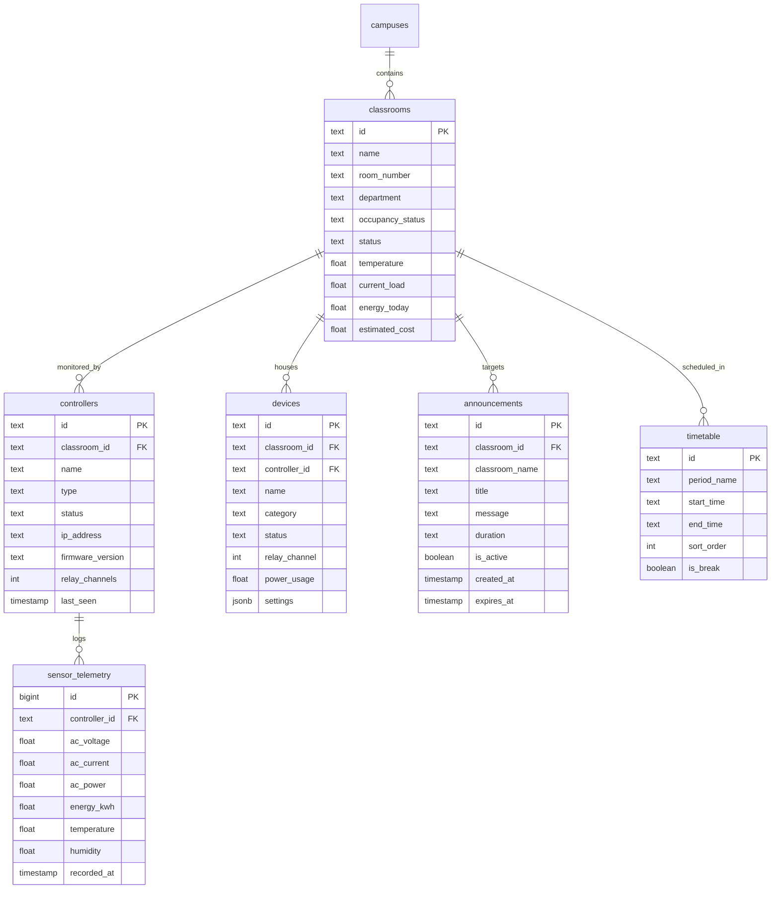

# FISAT Smart Campus Automation System
## Comprehensive Technical Architecture, Firmware, and Mobile Application Documentation

---

### Table of Contents
1. [Executive Overview](#1-executive-overview)
2. [High-Level System Architecture](#2-high-level-system-architecture)
3. [Dual-Path Communication Workflow (LAN vs. Realtime Cloud)](#3-dual-path-communication-workflow)
4. [ESP32 Firmware Architecture (v2.5.0)](#4-esp32-firmware-architecture)
   - [Master Pin Mapping & Hardware Specifications](#master-pin-mapping--hardware-specifications)
   - [ESP32 Physical Board Wiring Diagram](#esp32-physical-board-wiring-diagram)
   - [Dual I2C Bus & OLED Display Architecture](#dual-i2c-bus--oled-display-architecture)
   - [Multi-Sample Debounced PIR Motion & Occupancy Engine](#multi-sample-debounced-pir-motion--occupancy-engine)
   - [Autonomous Timetable & Musical Bell Scheduler](#autonomous-timetable--musical-bell-scheduler)
   - [Digital Notice Board & Cloud Broadcast Engine](#digital-notice-board--cloud-broadcast-engine)
   - [24/7 Autonomous Device Schedules](#247-autonomous-device-schedules)
   - [WS2812B 15-LED Addressable Strip Animation Engine](#ws2812b-15-led-addressable-strip-animation-engine)
   - [AC Mains Power & Riemann Energy Metering Engine](#ac-mains-power--riemann-energy-metering-engine)
   - [FreeRTOS Dual-Core Concurrency Allocation](#freertos-dual-core-concurrency-allocation)
   - [Hardware Protection Mechanisms](#hardware-protection-mechanisms)
   - [Local REST API Specification](#local-rest-api-specification)
5. [React Native / Expo Mobile Application Architecture](#5-react-native--expo-mobile-application-architecture)
   - [Core State Management & Lifecycle](#core-state-management--lifecycle)
   - [Persistent Device Ordering Engine](#persistent-device-ordering-engine)
   - [Screen & Component Hierarchy](#screen--component-hierarchy)
   - [Custom Drum-Wheel Time Picker](#custom-drum-wheel-time-picker)
   - [Tactile Haptic Feedback System](#tactile-haptic-feedback-system)
   - [Custom Appliance Power Rating Engine](#custom-appliance-power-rating-engine)
6. [Cloud Database Architecture (Supabase)](#6-cloud-database-architecture-supabase)
7. [Complete System Hardware Wiring Diagram](#7-complete-system-hardware-wiring-diagram)
8. [Setup, Deployment & Testing Guide](#8-setup-deployment--testing-guide)

---

### 1. Executive Overview

The **FISAT Smart Campus Automation System** is an enterprise-grade IoT solution engineered for modern multi-zone educational institutions. Built specifically for **Federal Institute of Science And Technology (FISAT)**, the platform coordinates physical classroom infrastructure, intelligent occupancy automation, digital campus communication, musical class period bells, addressable corridor illumination, and high-precision AC power analytics.

#### Key Platform Capabilities:
- **Intelligent Occupancy-Driven Multi-Zone Automation:** Multi-sample debounced PIR motion sensors (GPIO 32/33) with autonomous 15s power-on stabilization grace period and configurable hold timers (10s–300s). Dynamically actuates lighting, ventilation (temperature-triggered ceiling fans), and motorized curtains across **Classroom A101** and **Classroom A102**.
- **Daylight-Harvesting Corridor Lighting:** Dual analog LDR light sensors with hysteresis and moving-average filtering automatically engage corridor illumination when ambient lux falls below threshold.
- **Dual Hardware I2C OLED Displays:**
  1. *Primary Telemetry Display (Wire: GPIO 21/22):* Live controller status, Wi-Fi IP, active load wattage, RMS voltage/current, and today's accumulated energy.
  2. *Classroom Digital Notice Board (Wire1: GPIO 13/15):* 20-second rotating broadcast notice carousel with auto-expiring announcements and high-contrast synchronized campus clock.
- **Autonomous Campus Bell & Period Scheduler:** Internal 8-period timetable engine running locally on the ESP32. Synchronizes period boundaries with NTP real-time clock and rings musical chimes (Westminster Quarters, Japanese School Bell, College Bell) via an onboard audio alert buzzer (GPIO 23).
- **12-Mode Addressable WS2812B Corridor LED Strip:** 15 NeoPixels (GPIO 5) driven with custom non-blocking animations (Solid, Breathe, Rainbow, Strobe, Chase, Fire, Meteor, Police, Aurora, Twinkle, Heartbeat, Cyberpunk) with dynamic hex color picking and brightness scaling.
- **Physical AC Mains Power & Energy Metering:** Real-time root-mean-square (RMS) sampling of 230V AC mains voltage (ZMPT101B) and load current (ACS712) for Classroom A101 with Riemann sum energy integration (kWh) stored persistently in Non-Volatile Storage (NVS).
- **Dual-Path Sub-100ms Communication:** Combines ultra-low latency direct local Wi-Fi REST commands (10–25ms) with persistent Supabase Realtime WebSockets (`wss://`) on Core 0 for instantaneous push control over cellular/mobile data.
- **Cross-Platform Mobile Management (React Native & Expo):** Native iOS and Android app featuring biometric/database authentication, real-time telemetry graphs, drum-wheel schedule pickers, haptic tactile feedback, and customizable appliance power ratings.

---

### 2. High-Level System Architecture

```mermaid
graph TD
    subgraph EdgeHardware ["ESP32 Edge Microcontroller (ESP32-WROOM-32)"]
        subgraph Sensors ["Sensory Inputs (ADC1 & Digital)"]
            ACS["ACS712 (AC Current - GPIO 36)"]
            ZMPT["ZMPT101B (AC Voltage - GPIO 39)"]
            DHT["DHT11 (Temp/Hum - GPIO 4)"]
            PIR["2x PIR Motion (GPIO 32 / 33)"]
            LDR["2x Corridor LDR (GPIO 34 / 35)"]
        end

        subgraph EdgeEngines ["Core 1 Real-Time Control & Core 0 Cloud Engine"]
            RMS["AC RMS Metering & kWh Accumulator"]
            OccEngine["Debounced Occupancy State Machine"]
            SchedEngine["Timetable & Bell Melody Synthesizer"]
            AnimEngine["WS2812B 12-Mode FX Engine"]
            NoticeEngine["Dual-Display Carousel Controller"]
            LocalServer["Local REST API WebServer (:80)"]
            CloudWS["Supabase Realtime WebSocket (:443)"]
        end

        subgraph Actuators ["Physical Actuators & Outputs"]
            Relays["6-Channel Optocoupled Relays (GPIO 25, 27, 26, 14, 16, 17)"]
            Servos["2x SG90 Curtain Servos (GPIO 18 / 19)"]
            WSStrip["15x WS2812B LED Strip (GPIO 5)"]
            Buzzer["3V Piezo / Active Buzzer (GPIO 23)"]
            OLED1["Telemetry OLED (Wire: GPIO 21 / 22)"]
            OLED2["Notice Board OLED (Wire1: GPIO 13 / 15)"]
        end

        Sensors --> EdgeEngines
        EdgeEngines --> Actuators
    end

    subgraph Networks ["Hybrid Dual-Path Connectivity Layer"]
        LocalLAN["Local Subnet Wi-Fi (HTTP REST)<br/>Latency: ~15ms"]
        CloudRealtime["Supabase Realtime WebSocket (wss://)<br/>Latency: <80ms"]
        CloudREST["Supabase PostgREST (HTTPS REST)<br/>Telemetry & Persistent Sync"]
    end

    subgraph AppLayer ["Client Mobile Application (Expo / React Native)"]
        AppUI["FISAT Smart Campus Mobile App<br/>• Live Dashboard & Classroom Cards<br/>• Digital Notice Board Carousel<br/>• Period Timetable & Bell Configuration<br/>• 12-Mode WS2812B Lighting Studio<br/>• Energy Analytics & Custom Ratings<br/>• Hardware Health Diagnostics"]
    end

    EdgeHardware <-->|Direct HTTP JSON| LocalLAN
    EdgeHardware <-->|Bi-Directional WSS Push| CloudRealtime
    EdgeHardware <-->|HTTPS Telemetry PATCH| CloudREST
    LocalLAN <-->|Primary Fast Path| AppLayer
    CloudRealtime <-->|Remote Realtime Fast Path| AppLayer
    CloudREST <-->|Cloud Sync & Historical Data| AppLayer
```



---

### 3. Dual-Path Communication Workflow

The system implements a **Hybrid Dual-Path** networking architecture to guarantee instant responsiveness when on-campus, alongside worldwide real-time reach over cellular networks:

```text
                    +------------------------------------+
                    |        User Taps Appliance         |
                    |       in Mobile Application        |
                    +-----------------+------------------+
                                      |
                     [ Is ESP32 reachable over LAN? ]
                                     / \
                             YES    /   \   NO
                                   /     \
                                  v       v
         +----------------------------+   +-----------------------------+
         |     PATH A (Local LAN)     |   | PATH B (Cloud Realtime WS)  |
         |----------------------------|   |-----------------------------|
         | • HTTP POST /api/control   |   | • Supabase Realtime Channel |
         |   directly to ESP32 IP     |   |   (phx_push device_control) |
         | • Latency: 10–25ms         |   | • Latency: 40–80ms          |
         | • Zero cloud dependency    |   | • Worldwide cellular reach  |
         +--------------+-------------+   +--------------+--------------+
                        |                                |
                        |     +--------------------+     |
                        +---->| ESP32 Actuates Pin |<----+
                              |  (Physical Relay)  |
                              +--------------------+
                                        |
                 +----------------------+----------------------+
                 |                                             |
                 v                                             v
     [Local OLED Refresh]                          [Supabase Telemetry PATCH]
     Status & Energy updated                       HTTP 204 keeps all mobile
     instantly on screen                           clients in sync (<1s)
```

1. **Path A — Direct Local LAN (Primary Fast Path):**
   - Active whenever the smartphone and ESP32 are connected to the same Wi-Fi router.
   - The app sends lightweight JSON payloads (`{"deviceId": "dev-a101-light-1", "state": true}`) directly to `http://<esp32-ip>/api/control`.
   - Response time is nearly instantaneous (10–25ms), completely bypassing external internet infrastructure.
2. **Path B — Supabase Realtime WebSockets (Universal Fast Remote Fallback):**
   - Active when operating remotely via cellular data (4G/5G) or from outside the classroom network.
   - Uses persistent WebSockets on Core 0 (`wss://iynufzhopcrdadtluqnx.supabase.co:443/realtime/v1/websocket`).
   - Push commands dispatch over Phoenix Realtime channels with sub-100ms latency, eliminating slow 1.5s HTTP polling delays.

---

### 4. ESP32 Firmware Architecture

#### Master Pin Mapping & Hardware Specifications

| Peripheral / Component | ESP32 GPIO | Direction / Mode | Power Rail | Hardware Function & Protection |
| :--- | :--- | :--- | :--- | :--- |
| **Telemetry OLED (SDA)** | **GPIO 21** | I2C Data (`Wire`) | 3.3V | SSD1306 Display 1: System Telemetry, Wi-Fi & AC Power |
| **Telemetry OLED (SCL)** | **GPIO 22** | I2C Clock (`Wire`) | 3.3V | SSD1306 Display 1: System Telemetry, Wi-Fi & AC Power |
| **Notice Board OLED (SDA)** | **GPIO 13** | I2C Data (`Wire1`) | 3.3V | SSD1306 Display 2: Campus Notice Board & Synchronized Clock |
| **Notice Board OLED (SCL)** | **GPIO 15** | I2C Clock (`Wire1`) | 3.3V | SSD1306 Display 2: Campus Notice Board & Synchronized Clock |
| **3V Audio Alert Buzzer** | **GPIO 23** | Output (LEDC PWM) | 3.3V | Passive Piezo / Active Buzzer for Timetable Bells & Notice Chimes |
| **WS2812B Addressable LED Strip** | **GPIO 5** | Digital Output | 5V / 3.3V Sig | 15-LED NeoPixel strip for Corridor Illumination & 12 Visual FX |
| **DHT11 / DHT22 Sensor** | **GPIO 4** | Bidirectional Data | 3.3V | Non-blocking climate monitoring (Temperature & Humidity) |
| **PIR Motion 1 (Classroom A101)** | **GPIO 32** | Digital In (Pull-down)| 3.3V / 5V | ADC1 safe, 60ms multi-sample debounce, 15s power-on grace |
| **PIR Motion 2 (Classroom A102)** | **GPIO 33** | Digital In (Pull-down)| 3.3V / 5V | ADC1 safe, 60ms multi-sample debounce, 15s power-on grace |
| **Corridor 1 LDR Sensor** | **GPIO 34** | Analog In (ADC1_CH6)| 3.3V | Ambient daylight level (10-sample moving average + hysteresis) |
| **Corridor 2 LDR Sensor** | **GPIO 35** | Analog In (ADC1_CH7)| 3.3V | Ambient daylight level (10-sample moving average + hysteresis) |
| **ACS712 Current Sensor** | **GPIO 36** | Analog In (SENSOR_VP)| 5V VCC / 3.3V Sig | Dedicated Classroom A101 AC Current (ADC1_CH0, 400-sample RMS) |
| **ZMPT101B Voltage Sensor** | **GPIO 39** | Analog In (SENSOR_VN)| 5V VCC / 3.3V Sig | Dedicated Classroom A101 AC 230V Voltage (ADC1_CH3, 400-sample RMS) |
| **Servo 1 (A101 Curtains)** | **GPIO 18** | Output (LEDC PWM) | 5V VCC / 3.3V Sig | Motorized blinds / curtain (0° Closed, 80° Open) with auto-detach |
| **Servo 2 (A102 Curtains)** | **GPIO 19** | Output (LEDC PWM) | 5V VCC / 3.3V Sig | Motorized blinds / curtain (0° Closed, 80° Open) with auto-detach |
| **Relay 1 (A101 Main Lights)** | **GPIO 25** | Digital Output | 5V VCC / 3.3V Sig | Active-LOW, staggered startup, anti-pop boot latch |
| **Relay 2 (A101 Ceiling Fan)** | **GPIO 27** | Digital Output | 5V VCC / 3.3V Sig | Active-LOW, staggered startup, climate automation |
| **Relay 3 (A102 Main Lights)** | **GPIO 26** | Digital Output | 5V VCC / 3.3V Sig | Active-LOW, staggered startup, anti-pop boot latch |
| **Relay 4 (A102 Ceiling Fan)** | **GPIO 14** | Digital Output | 5V VCC / 3.3V Sig | Active-LOW, staggered startup, climate automation |
| **Relay 5 (Corridor 1 Light)** | **GPIO 16** | Digital Output | 5V VCC / 3.3V Sig | Active-LOW, staggered startup, autonomous LDR & schedule control |
| **Relay 6 (Corridor 2 Light)** | **GPIO 17** | Digital Output | 5V VCC / 3.3V Sig | Active-LOW, staggered startup, autonomous LDR & schedule control |

---

#### ESP32 Physical Board Wiring Diagram

```text
                                  +-----------------------+
                                  |     [ESP-WROOM-32]    |
                                  |    uPesy DevKit Pin   |
                                  +-----------------------+
                     3.3V Power -- | [3V3]           [GND] | -- Common Ground
                         Enable -- | [EN]            [G23] | -- 3V Audio Buzzer (+)
    ACS712 Current (ADC1_CH0) VP -- | [VP/36]         [G22] | -- Telemetry OLED SCL (Wire)
    ZMPT101B Volts (ADC1_CH3) VN -- | [VN/39]         [TX0] | -- [USB Serial TXD / Free]
      Corridor 1 LDR (ADC1_CH6) -- | [G34]           [RX0] | -- [USB Serial RXD / Free]
      Corridor 2 LDR (ADC1_CH7) -- | [G35]           [G21] | -- Telemetry OLED SDA (Wire)
            A101 PIR Motion In  -- | [G32]           [GND] | -- Common Ground
            A102 PIR Motion In  -- | [G33]           [G19] | -- A102 Curtain Servo (PWM)
             Relay 1: A101 Light -- | [G25]           [G18] | -- A101 Curtain Servo (PWM)
             Relay 3: A102 Light -- | [G26]            [G5] | -- WS2812B 15-LED Strip Data
               Relay 2: A101 Fan -- | [G27]           [G17] | -- Relay 6: Corridor 2 Light
               Relay 4: A102 Fan -- | [G14]           [G16] | -- Relay 5: Corridor 1 Light
               [Unused / Free]   -- | [G12]            [G4] | -- DHT11 / DHT22 Data
                   Common Ground -- | [GND]            [G0] | -- [Boot Button / Free]
         Notice OLED SDA (Wire1) -- | [G13]            [G2] | -- [Onboard Blue LED]
      (Flash SD2 - Do Not Conn)  -- | [SD2]           [G15] | -- Notice OLED SCL (Wire1)
      (Flash SD3 - Do Not Conn)  -- | [SD3]           [SD1] | -- (Flash SD1 - Do Not Conn)
      (Flash CMD - Do Not Conn)  -- | [CMD]           [SD0] | -- (Flash SD0 - Do Not Conn)
            5V External Power In -- | [5V]            [CLK] | -- (Flash CLK - Do Not Conn)
                                  +-----------------------+
                                  |       [MicroUSB]      |
                                  |     [RST]   [BOOT]    |
                                  +-----------------------+
```

---

#### Dual I2C Bus & OLED Display Architecture

The firmware drives two separate 0.96" SSD1306 OLED displays at the same hardware address (`0x3C`) without requiring multiplexers or SMD trace cuts by leveraging the ESP32's dual hardware I2C peripherals:

1. **Telemetry Display (`Wire`):**
   - Assigned to **GPIO 21 (SDA) / GPIO 22 (SCL)** at 400kHz.
   - Shows active Wi-Fi SSID, Controller IP address, AC RMS voltage, current, active power (W), and energy today (kWh).
2. **Classroom Notice Board Display (`Wire1`):**
   - Assigned to **GPIO 13 (SDA) / GPIO 15 (SCL)** at 400kHz.
   - Rotates active broadcast notices every 20 seconds.
   - Automatically switches to a synchronized full-screen **Campus Clock** every 2 minutes for 8 seconds.
   - Displays a dedicated high-visibility **"PERIOD OVER"** banner when the campus bell rings.
3. **Hardware ACK Probing & Fault Isolation:**
   - Both buses actively probe for device ACK via `Wire.beginTransmission(0x3C); if (Wire.endTransmission() == 0)` before attempting allocation.
   - Equipped with `Wire.setTimeOut(30)` to ensure that if a display wire is disconnected during operation, the controller recovers within 30ms without locking the CPU or watchdog.

---

#### Multi-Sample Debounced PIR Motion & Occupancy Engine

To completely eliminate false occupancy triggers and relay chatter, the firmware implements a 3-layer signal filtration pipeline:

1. **Power-On Grace Period:**
   - For the first **15 seconds** after boot (`PIR_WARMUP_MS`), all PIR inputs are locked to `false` while the sensor's internal pyroelectric element stabilizes to ambient temperature.
2. **Multi-Sample Verification Filter:**
   - Sensor inputs are sampled at discrete **60ms intervals** (`PIR_SAMPLE_INTERVAL_MS`).
   - A consecutive threshold of **3 samples (180ms continuous HIGH)** is strictly required before a state transition to `OCCUPIED` is recognized.
3. **Debounced Occupancy Hold Timers:**
   - When motion ceases, an autonomous countdown timer (`currentHoldTime`, configurable from 10s to 300s, default 30s) prevents premature shutdown.
   - Once quiet for the full duration, the room transitions to `VACANT`.
   - In **Auto Mode**, lights and curtains automatically power off to conserve power, and fans power down if the room is vacant.
   - All state transitions immediately trigger an autonomous telemetry sync (`queueDeviceCloudSync`) to update Supabase in <1 second.

---

#### Autonomous Timetable & Musical Bell Scheduler

The ESP32 firmware features a completely autonomous, internal real-time bell scheduler operating independently of internet connectivity:

- **Timetable Configuration:** Stores 8 customizable periods with period names, start times, and end times in NVS flash memory (`tt_json`).
- **NTP Time Synchronization:** Automatically syncs with Indian Standard Time (IST: UTC+5:30) via pool NTP servers.
- **Musical Melody Engine:** Drives the onboard audio buzzer (GPIO 23) using musical frequencies and note durations:
  - **Westminster Quarters:** Full 16-note Big Ben chime in F Major.
  - **Japanese School Bell:** Classic 4-phrase *Kin-Kon-Kan-Kon* chime.
  - **College Bell:** Triple-strike industrial campus bell.
  - **Notice Beep:** Lively 3-note marimba chime on new broadcast notice arrival.
- **Visual Bell Synchronization:** When a bell rings, the secondary notice OLED displays a custom banner showing which period just concluded, along with the exact time.

---

#### Digital Notice Board & Cloud Broadcast Engine

Broadcast campus announcements are managed across three scopes: `all`, `cls-a101`, and `cls-a102`:

- **Auto-Expiry Durations:** Announcements can be posted with durations of `1h`, `4h`, `12h`, `24h`, or `permanent`.
- **Cloud Reconciliation:** The ESP32 continuously synchronizes active notices from Supabase, filters expired notices, and caches them to NVS flash (`notices_json`) so that notices remain visible on the physical OLED even through a power outage.
- **Carousel Animation:** The physical notice OLED cycles through active messages with smooth horizontal separator lines, priority badges, and author timestamps.

---

#### 24/7 Autonomous Device Schedules

For facility operations outside classroom hours, the firmware supports independent 24/7 recurring schedules:

- Targetable devices: **Corridor Light 1**, **Corridor Light 2**, and the **WS2812B RGB Strip**.
- Each schedule defines:
  - `enabled`: Toggle schedule active/inactive.
  - `turnOnTime`: Scheduled turn-on time (e.g., `18:30`).
  - `turnOffTime`: Scheduled turn-off time (e.g., `06:00`).
  - `daysOfWeek`: Bitmask flags for days Monday through Sunday (e.g., `0x3E` for Weekdays).
  - `autoOffMinutes`: Inactivity timeout to auto-extinguish loads if turned on manually.

---

#### WS2812B 15-LED Addressable Strip Animation Engine

Connected to **GPIO 5**, the 15-LED NeoPixel strip provides decorative and functional hallway lighting:

- **12 Dynamic FX Modes:**
  1. `solid`: Static single-color illumination.
  2. `breathe`: Sinusoidal smooth brightness pulsing.
  3. `rainbow`: Smooth 360° color cycle across all 15 LEDs.
  4. `strobe`: High-frequency rhythmic flash.
  5. `chase`: Running dot effect with trailing tail.
  6. `fire`: Flickering campfire simulation with randomized red/orange/yellow heat.
  7. `meteor`: Decaying comet streak with tail fading.
  8. `police`: Emergency alternating dual-flash red/blue warning strobe.
  9. `aurora`: Dual-sine Northern Lights teal/magenta wave.
  10. `twinkle`: Night sky shimmering starfield.
  11. `heartbeat`: Double-beat cardiac arterial pulse simulation.
  12. `cyberpunk`: Neon cyan/magenta phase shift.
- **Hardware Integration:** Non-blocking state update every 20–60ms without delaying the main control loop or RMS sensor sampling.

---

#### AC Mains Power & Riemann Energy Metering Engine

Classroom A101 features an AC RMS sampling routine (`sampleA101PowerMeter()`):

1. **RMS Waveform Integration:** Collects 400 analog samples across multiple 50Hz mains AC cycles (40ms). Calculates standard deviation around the DC quiescent offset.
2. **Noise Gate Rejection:**
   - Readings below `60.0V` are clamped to zero (filters open-circuit 50Hz electromagnetic coupling on high-gain ZMPT101B amplifiers).
   - Current readings below `0.09A` are clamped to zero (filters Hall-effect thermal drift and baseline switching noise).
3. **Active Power & Riemann Integration:**
   - Active Power: $P = V_{RMS} \times I_{RMS} \times \text{PF}$ (default Power Factor = 0.95).
   - Energy Accumulation: $E_{(kWh)} = E_{(kWh)} + \left(\frac{P_{(W)}}{1000} \times \Delta t_{(h)}\right)$.
   - Accumulated values persist into NVS flash every 5 minutes and reset automatically at midnight.

---

#### FreeRTOS Dual-Core Concurrency Allocation

- **Core 0 (Cloud Task):** Runs `supabaseCloudTask` with 16KB dedicated stack. Handles HTTPS TLS handshakes, payload serialization, Supabase Realtime WebSocket client, and telemetry without causing jitter on Core 1.
- **Core 1 (Real-Time Control):** Runs the primary Arduino `loop()`, high-speed analog RMS sensor sampling, physical relay switching, servo PWM actuation, WS2812 animation ticks, and the local HTTP REST server.

---

#### Hardware Protection Mechanisms

- **Brownout Detector Disabled on Boot:** `WRITE_PERI_REG(RTC_CNTL_BROWN_OUT_REG, 0)` eliminates spurious ESP32 resets from momentary inductor/relay coil inrush dips.
- **Anti-Pop Boot Sequencing:** Output registers are forced to `HIGH` (`RELAY_OFF`) *before* executing `pinMode(pin, OUTPUT)`, completely eliminating the momentary power-on click/flash.
- **Staggered Relay Actuation:** `applyRelayStates()` implements state caching and 15ms sequential switching delays to prevent simultaneous current draw spikes.
- **Servo Thermal Protection:** After curtain movement completes, the servo PWM signal detaches after an 800ms idle window to eliminate buzzing and gear fatigue.

---

#### Local REST API Specification

| Endpoint | Method | Parameters / Body | Description |
| :--- | :--- | :--- | :--- |
| `GET /` | `GET` | *None* | Healthcheck returning `{"system": "FISAT Smart Campus Controller", "firmware": "2.5.0", "status": "online"}` |
| `GET /status`<br/>`GET /api/status` | `GET` | *None* | Returns full system JSON telemetry (RMS voltage, current, power, temperature, occupancy, relay states, and SSID) |
| `GET /ctrl`<br/>`POST /api/control`| `GET/POST`| `?dev=<id>&st=<0\|1>`<br/>`{"deviceId": "...", "state": true}` | Actuates a physical relay or servo channel immediately |
| `GET /mode`<br/>`POST /api/mode` | `GET/POST`| `?auto=<0\|1>`<br/>`{"auto": true}` | Toggles between autonomous PIR/LDR automation and manual override mode |
| `GET /config` | `GET` | `?temp_th=26.0&hold_ms=30000...` | Queries or updates operational thresholds and rated wattages in NVS |

---

### 5. React Native / Expo Mobile Application Architecture

#### Core State Management & Lifecycle ([`context/AppContext.tsx`](file:///c:/Users/Ashil/Desktop/NBA%20Project/FISAT_Smart_Campus/context/AppContext.tsx))

- **Unified Central State:** Manages campuses, classrooms, connected devices, active alerts, notices, timetable schedules, and real-time telemetry.
- **Automatic Controller Discovery:** Probes the local subnet every 3 seconds to detect the ESP32 IP address and determine LAN vs. Cloud mode.
- **Bi-Directional Supabase Sync:** Listens to real-time database changes over PostgreSQL CDC and publishes local state modifications with optimistic UI updates.

---

#### Persistent Device Ordering Engine

To prevent UI elements from jumping or shifting order across app launches, devices are strictly sorted using a deterministic priority index:

```typescript
const DEVICE_CATEGORY_ORDER: Record<string, number> = {
  light: 10,
  fan: 20,
  curtain: 30,
  display: 40,
  system: 50,
  other: 60,
};
```
Within each category, devices sort deterministically by their physical relay pin number, ensuring an identical, predictable layout on every launch.

---

#### Screen & Component Hierarchy

- **Home Dashboard ([`app/(tabs)/index.tsx`](file:///c:/Users/Ashil/Desktop/NBA%20Project/FISAT_Smart_Campus/app/(tabs)/index.tsx)):**
  - `HomeHeader`: Campus branding, department badge, profile avatar, and unread notification counter.
  - `NoticeBoardCard`: Interactive broadcast announcement carousel with scope indicator, priority badge, and auto-rotation.
  - `EnergyOverviewCard`: Today's accumulated kWh, instantaneous active wattage load, and online device count.
  - `Esp32LiveBar`: Real-time hardware status capsule displaying LAN vs. Cloud mode, controller IP, and setup modal.
  - `QuickControls`: Master toggles for All Lights, All Fans, All Curtains, Auto Mode, and Emergency Power Off.
  - `ClassroomCard`: Multi-room cards displaying occupancy, temperature, power load, and quick relay toggles.
- **Classroom Detailed View ([`app/classroom/[id].tsx`](file:///c:/Users/Ashil/Desktop/NBA%20Project/FISAT_Smart_Campus/app/classroom/[id].tsx)):**
  - AC Power Telemetry card displaying real-time Mains RMS Voltage, Load RMS Current, and Active Power.
  - Environmental climate status (DHT11 Temperature & Humidity).
  - Deterministically ordered device grid with toggle switches and rated power badges.
- **Campus Notice Board Screen ([`app/(tabs)/announcements.tsx`](file:///c:/Users/Ashil/Desktop/NBA%20Project/FISAT_Smart_Campus/app/(tabs)/announcements.tsx)):**
  - Complete list of active campus announcements with scope filter chips (`All`, `A101`, `A102`).
  - Remaining time countdown badges (`expires in 23h 45m`).
  - Modal for composing new broadcasts with title, body, scope selection, and expiry duration.
  - Swipe/tap notice deletion with immediate cloud and physical OLED sync.
- **Period Timetable & Campus Bell Screen ([`app/timetable.tsx`](file:///c:/Users/Ashil/Desktop/NBA%20Project/FISAT_Smart_Campus/app/timetable.tsx)):**
  - 8-period timetable editor with active countdown badge showing the current period and time remaining.
  - Bell melody selector (*Westminster Quarters*, *Japanese School Bell*, *College Bell*, *Standard Beep*).
  - Test Bell trigger for manual chime verification.
  - Custom drum-wheel time picker modal for smooth schedule modification.
- **Device Detailed Screen ([`app/device/[id].tsx`](file:///c:/Users/Ashil/Desktop/NBA%20Project/FISAT_Smart_Campus/app/device/[id].tsx)):**
  - Nameplate Rated Power Specification editor with quick presets (e.g., 40W, 60W, 75W, 100W) and custom step increment buttons.
  - Physical action buttons (*Turn On*, *Turn Off*, *Open*, *Close*).
  - WS2812B Lighting Studio (Color palette, 12 FX mode selector, and brightness slider).
  - 24/7 Autonomous Device Scheduler modal for corridor circuits.
  - ESP32 hardware pin diagnostics mapping the device to its physical relay/servo channel.
- **Energy Analytics Dashboard ([`app/(tabs)/energy.tsx`](file:///c:/Users/Ashil/Desktop/NBA%20Project/FISAT_Smart_Campus/app/(tabs)/energy.tsx)):**
  - Interactive bar charts for Hourly (24h time-series from ESP32 telemetry), Daily (7-day week), and Weekly energy consumption.
  - Energy ranking and cost breakdown.
- **Settings & Hardware ([`app/(tabs)/settings.tsx`](file:///c:/Users/Ashil/Desktop/NBA%20Project/FISAT_Smart_Campus/app/(tabs)/settings.tsx)):**
  - Theme mode selector (Obsidian Dark vs. Daylight Light theme).
  - Live hardware specs, dynamic Wi-Fi SSID, firmware version, and institution details.

---

#### Custom Drum-Wheel Time Picker

The application includes an iOS/Material-styled mechanical drum wheel time picker ([`components/DrumTimePickerModal.tsx`](file:///c:/Users/Ashil/Desktop/NBA%20Project/FISAT_Smart_Campus/components/DrumTimePickerModal.tsx)):

- Implemented using pure React Native `ScrollView` momentum deceleration.
- Triple-drum columns for **Hours (01–12)**, **Minutes (00–59)**, and **Period (AM/PM)**.
- Integrated tactile haptic clicks on scroll boundaries.
- Snaps precisely to 44px row heights with visual center-lens magnifiers.

---

#### Tactile Haptic Feedback System

All user interactions utilize a unified cross-platform haptic utility ([`utils/haptics.ts`](file:///c:/Users/Ashil/Desktop/NBA%20Project/FISAT_Smart_Campus/utils/haptics.ts)):

- `triggerHaptic.selection()`: Light tactile tick for tab switching, pill selection, and time drum scrolling.
- `triggerHaptic.impact()`: Medium tactile confirmation for relay toggles and mode changes.
- `triggerHaptic.success()`: Triple pulse for saving schedules or completing notice broadcasts.
- `triggerHaptic.error()`: Double alert buzz for network failure or validation errors.

---

#### Custom Appliance Power Rating Engine

- Users can customize the rated power of any appliance directly in [`app/device/[id].tsx`](file:///c:/Users/Ashil/Desktop/NBA%20Project/FISAT_Smart_Campus/app/device/[id].tsx).
- Saved ratings immediately synchronize across three tiers:
  1. **Local Persistent Cache:** Persisted to `@smart_classroom_rated_power_map` via `AsyncStorage`.
  2. **Active Runtime State:** Classroom `currentLoad` recalculates across the Home screen, Classroom cards, and Energy overview.
  3. **Cloud & Controller Synchronization:** Updated to Supabase (`devices.settings.ratedPower`) and pushed to ESP32 flash memory (`/config?c1_light_w=...`).

---

### 6. Cloud Database Architecture (Supabase)



---

### 7. Complete System Hardware Wiring Diagram

```text
                               +--------------------+
                               |   ESP32-WROOM-32   |
                               +--------------------+
                                 |    |    |    |
         +-----------------------+    |    |    +-----------------------+
         |                            |    |                            |
   [ GPIO 21 / 22 ]             [ GPIO 4 ] |                      [ GPIO 36 / 39 ]
   (Primary I2C)                      |    |                      (Analog ADC1)
         |                            |    |                            |
         v                            v    |                            v
  +---------------+             +-------+  |                      +---------------+
  | Telemetry OLED|             | DHT11 |  |                      | ACS712 / ZMPT |
  | Live AC Stats |             | Climate| |                      | Energy Meter  |
  +---------------+             +-------+  |                      +---------------+
                                           |
                 +-------------------------+-------------------------+
                 |                         |                         |
          [ GPIO 13 / 15 ]          [ GPIO 5 ]                [ GPIO 23 ]
          (Secondary I2C)           (NeoPixel PWM)            (Audio PWM)
                 |                         |                         |
                 v                         v                         v
       +-------------------+      +-------------------+      +-------------------+
       | Notice Board OLED |      | WS2812B LED Strip |      | 3V Audio Buzzer   |
       | Carousel & Clock  |      | 15 Corridor LEDs  |      | Musical Bells     |
       +-------------------+      +-------------------+      +-------------------+
                 |
                 +-------------------------+-------------------------+
                 |                         |                         |
          [ GPIO 32 / 33 ]          [ GPIO 34 / 35 ]          [ GPIO 18 / 19 ]
          (Digital Inputs)          (Analog ADC1)             (Servo PWM)
                 |                         |                         |
                 v                         v                         v
       +-------------------+      +-------------------+      +-------------------+
       | 2x PIR Motion     |      | 2x Corridor LDR   |      | 2x SG90 Servos    |
       | Debounced Presence|      | Daylight Sensing  |      | Motorized Blinds  |
       +-------------------+      +-------------------+      +-------------------+
                 |
                 +---------------------------------------------------+
                 |
          [ GPIO 25, 27, 26, 14, 16, 17 ]
          (Active-LOW Optocoupled Outputs)
                 |
                 v
       +-------------------------------------------------------------+
       | 6-Channel 5V Relay Board                                    |
       | Ch 1: Classroom A101 Main Lights    Ch 4: Classroom A102 Fan|
       | Ch 2: Classroom A101 Ceiling Fan    Ch 5: Corridor Light 1  |
       | Ch 3: Classroom A102 Main Lights    Ch 6: Corridor Light 2  |
       +-------------------------------------------------------------+
```

---

### 8. Setup, Deployment & Testing Guide

#### 1. Flashing the ESP32 Firmware
1. Open [`firmware/esp32_smart_classroom/esp32_smart_classroom.ino`](file:///c:/Users/Ashil/Desktop/NBA%20Project/FISAT_Smart_Campus/firmware/esp32_smart_classroom/esp32_smart_classroom.ino) in Arduino IDE.
2. Required Arduino Libraries:
   - `ESP32 Board Package` (v2.0.x or v3.0.x by Espressif)
   - `ArduinoJson` (v6.x)
   - `Adafruit SSD1306` & `Adafruit GFX Library`
   - `Adafruit NeoPixel`
   - `DHT sensor library`
   - `ESP32Servo`
3. In [`firmware/esp32_smart_classroom/config.h`](file:///c:/Users/Ashil/Desktop/NBA%20Project/FISAT_Smart_Campus/firmware/esp32_smart_classroom/config.h), verify your Wi-Fi credentials:
   ```cpp
   const char *const DEFAULT_WIFI_SSID = "YOUR_WIFI_SSID";
   const char *const DEFAULT_WIFI_PASSWORD = "YOUR_WIFI_PASSWORD";
   ```
4. Configure Boot Animation preferences:
   ```cpp
   #define ENABLE_BOOT_ANIMATION false // Set true for animated FISAT banner, false for instant boot (<1s)
   ```
5. Select board **ESP32 Dev Module**, select the COM port, and click **Upload**.
6. Open Serial Monitor at **115200 baud** to observe boot diagnostics, I2C bus detection, NTP synchronization, and sensor warmup.

#### 2. Running the Mobile Application Locally
1. Ensure dependencies are installed and lockfile is synchronized:
   ```bash
   npm install --package-lock-only
   ```
2. Start the Expo development server:
   ```bash
   npx expo start --tunnel
   ```
3. Open **Expo Go** on your Android or iOS device and scan the terminal QR code.
4. Ensure your smartphone is connected to the same Wi-Fi router as the ESP32 for direct LAN speed (~15ms). If operating over mobile data, the app automatically communicates via Supabase Realtime WebSockets (<80ms).

#### 3. Building the Production Android APK via EAS
1. Ensure EAS CLI is installed:
   ```bash
   npm install -g eas-cli
   ```
2. Build the standalone preview APK:
   ```bash
   eas build --platform android --profile preview
   ```
3. Once the build completes, download and install the generated `.apk` directly onto your Android device.
